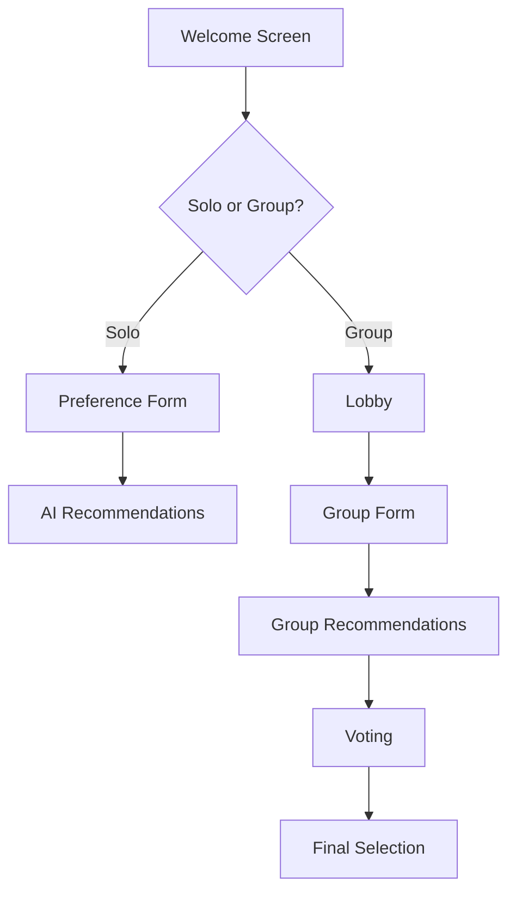

# WatchWizards 🎬

> An AI-powered movie recommendation platform for solo viewers and groups

## 🌟 Overview

WatchWizards is an intelligent movie recommendation platform that leverages AI to help users discover the perfect movie, whether watching alone or with friends. The platform provides personalized recommendations based on user preferences and facilitates group decision-making through a collaborative voting system.

## 🚀 Features

### Welcome Experience
- Elegant landing page featuring the WatchWizards brand
- One-click entry with "Summon the perfect movie" button
- Choice between Solo and Group viewing experiences

### Solo Mode 🎯
Users can get personalized recommendations by providing their preferences:

| Field | Description | Required |
|-------|-------------|----------|
| Content Type | Movie, Webseries, Anime, Short Films, or Surprise | Yes |
| Language | Preferred viewing language | No |
| Genre | Desired movie genre(s) | Yes |
| Plot | Detailed plot preferences | Yes |
| Similar Movies | Previously enjoyed films | No |
| Cast | Preferred actors/actresses | No |
| IMDb Rating | Minimum rating threshold | No |
| Mature Content | 18+ recommendations toggle | No |

#### Input Validation
- System ensures quality recommendations by monitoring input completeness
- Warning displayed if fewer than 4 fields are filled
- Options to add more information or proceed with limited data

### Group Mode 👥
Create or join a movie-watching party with friends:

#### Lobby Features
- Unique group keys (6-8 characters) for easy joining
- Lobby is valid for 1 hour
- Random usernames with customization option
- Real-time member list (max 10 users)
- Admin controls:
  - Member management
  - Number of recommendations (3-10)
  - Session start timing
  - Form filling timer setting (max 5 minutes)

#### Collaborative Decision Making
1. All members submit their preferences
2. System generates top recommendations accounting everyone's input data and presents the same recommendations to everyone
3. Anonymous voting system
4. Real-time top 3 suggestions with vote counts with a runner up

### Popular right now
In this section, users can explore a curated list of popular movies, shows, and anime, powered by the TMDB and OMDB APIs.

The interface will feature:
-Dynamic Sorting Options: Easily filter content by type, language, and genre to find exactly what you're in the mood for.
-Engaging Movie Cards: Each title will be displayed as an interactive card, showcasing essential details such as the name, genre, and a brief overview.
-Direct Links: Clicking on a movie card will take users directly to the IMDb page or the relevant source page, providing quick access to more information and ratings.

## 🔄 User Flow

## 💡 Key Benefits

- **Personalized Experience**: AI-powered recommendations tailored to individual or group preferences
- **Flexible Usage**: Perfect for both solo movie nights and group watching sessions
- **Democratic Selection**: Fair voting system for group decision-making
- **User-Friendly**: Intuitive interface with clear navigation and helpful prompts

## 🎯 Target Users

- Individual movie enthusiasts seeking personalized recommendations
- Friend groups struggling to choose a movie
- Film clubs and movie-watching communities
- Casual viewers looking to discover new content

---

*WatchWizards: Where AI meets entertainment, making movie selection magical!* ✨ 